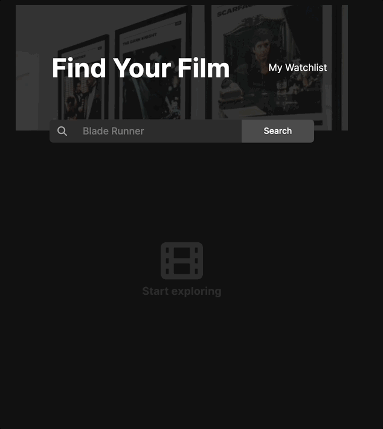

# Movie Watchlist
 A movie search app with a watchlist function built using Open Movie Database API
 [Try it here](https://superlative-torrone-fc53f8.netlify.app/index.html)

## Intro
A training project built to consolidate key concepts I learned from:

**Module 10 - Working with APIs** [Scrimba Frontend Career Path Course](https://scrimba.com/learn/frontend) 

## Lessons
- practice fetching data using APIs
- understand promises chaining
- handle promise rejections using .catch()

## Demo
 

